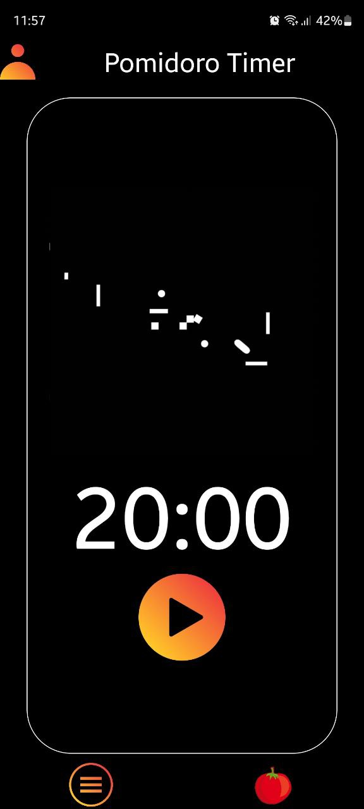

### Приложение для списка дел и техники Помодоро
## СТЕК:
#### - `Язык программирования: JavaScript`
#### - `Фреймворк: React Native`
#### - `Инструмент сборки и развертывания: Expo`
#### - `Зависимости`:
  - expo
  - expo-av
  - expo-keep-awake
  - expo-linear-gradient
  - expo-status-bar
  - react
  - react-native
  - react-native-linear-gradient
  - react-native-web
  - react-dom`

Представленное на фотографиях приложение является удобным инструментом для создания списка дел и использования методики Помодоро. Вот краткое описание каждого изображения:

1. Нижнее меню:  
   - Компоненты: "Todo List", "Таймер Pomodoro"

2. Второе приложение (Таймер Помодоро):  
   - Таймер обратного отсчёта (Сейчас 20 минут)  
   - После окончания таймера звучит звуковой сигнал, и начинается перерыв на 5 минут

3. Todo List (Список дел):  
   - В поле ввода можно записывать задачи, и при нажатии на "+" они добавляются в общий список  
   - Задания можно удалять, нажав на иконку "Корзина"

Эти приложения предоставляют функционал для эффективного планирования и управления задачами. В будущем они могут развиваться и добавлять дополнительные функции, такие как настройка времени таймера и перерывов.